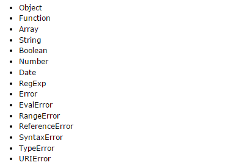

# 对象类型
    一般来说，可以创建并使用的对象有三种：本地对象、内置对象、和宿主对象
#### 本地对象
    独立于宿主环境的ES实现提供的对象。简单来说，本地对象就是ES定义的类。

#### 内置对象
    由ES实现提供的、独立于宿主环境的所有对象，在ES程序开始执行时出现。
    ES只定义了两个内置对象Globle、Math
#### 宿主对象
    由ES实现的宿主环境提供的对象。
    所有DOM和BOM都是宿主对象
