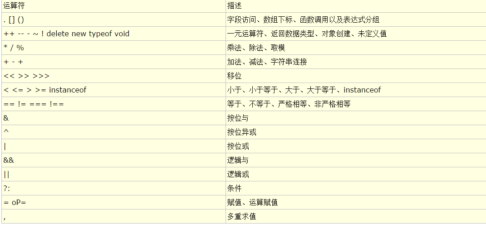
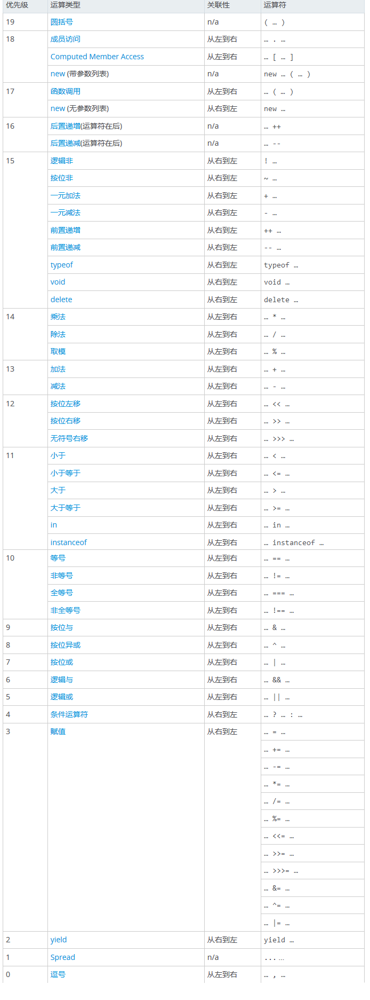

# 运算符

[一元运算符](一元运算符.md)

[逻辑运算](./逻辑运算.md)

 ***加减运算，如果有一个运算数是字符串，则为字符串拼接***

#### 运算符优先级参考
[运算符优先级>>](https://developer.mozilla.org/zh-CN/docs/Web/JavaScript/Reference/Operators/Operator_Precedence?_blank)

